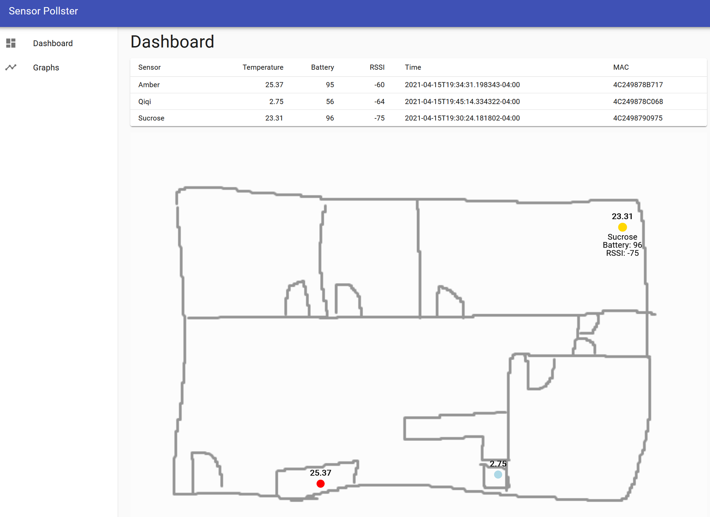
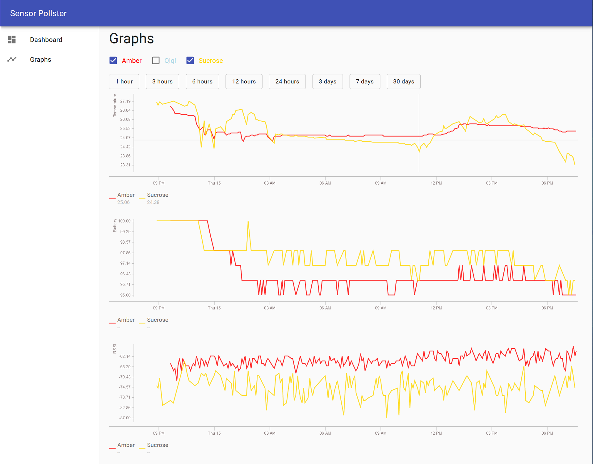

sensor-pollster-web
---

A web interface for [sensor-pollster](https://github.com/johnmave126/sensor-pollster). Monitor temperature of different places in home at low cost.

## Features

Shows sensor data on a floor plan (terrible mouse drawn demo):

Plot time series of sensor data (using [react-timeseries-charts](http://software.es.net/react-timeseries-charts/#/)):

## How to use

- Use the `.Net Core 3.1` docker image to host `SensorPollsterWebServer` behind a reverse proxy
- Build the frontend `sensor-pollster-web-client` with `node`
